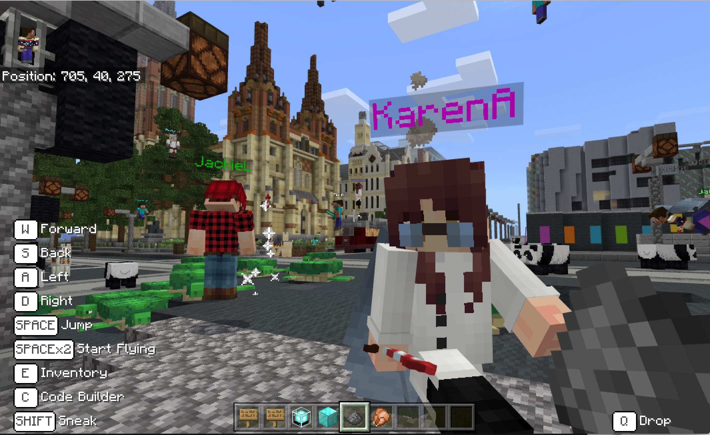
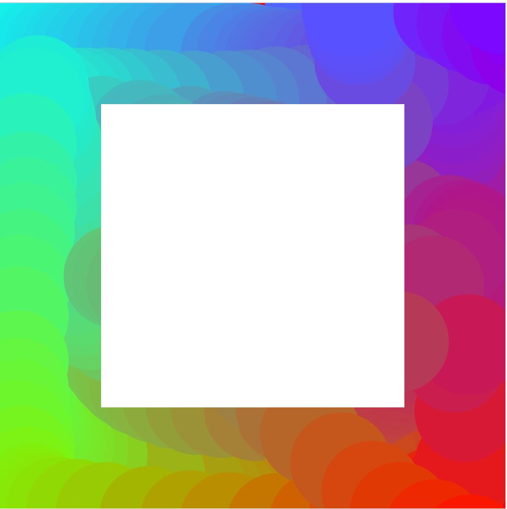

# A Whole New World 

First class! Today Andy went through an introduction to reading through online platforms, as we discussed HOW we read online and the difference between reading online and on paper. An example of this is twitter - creating short, concise statements that easily captures an audience without using too much text. The concept of digital reading was then tied in with code, and how it could be used to create new ways to read online - something I've never really considered. The idea of creating new interpretations of reading seems quite foreign and unknown to me currently, but I'm also quite excited to discover more and trial this out. 

We as a class also decided to move into the minecraft world as Karen and Andy introduced us to games being another virtual tool to read. Not being an avid player of minecraft, I was sceptical of what we'd be learning through the game, but as I followed along through Flinders St Station whilst Andy and Karen were talking, I felt like i was a protagonist to some sort of film or book. It was interesting how immersive this sensation felt, and opened my eyes to how narratives are created through virtual games. 

Image credit: Andy Simionato

In saying this, Andy briefed us on our first assignment being an interpretation of a text via a game we choose in groups. The text given to us was 'House of Leaves' by Mark Z. Danielewski - a horror text where characters appear to be trapped physically and mentally. Looking forward to reading more into the book! The group I've been placed in decided to use the game Animal Crossing to reinact one of the chapters, the family friendly game being a juxtaposition with the sinister text. 

With Karens help, we began our tutorial on processing and how code functions through this format of p5js - changing colours using the mousex/mousey functions, how to create shapes, and some concrete information on the basic fundementals of code. This being my first time utilising processing and code in a design format, I realised how interactive your artworks and designs can be as a user just by the simple click of a mouse. [here is a link to what we worked on!](https://renpapers.github.io/codeword/Processing%20Sketches/laurensfirstsketchprogress/)

As a set task, we were told to mess around with processing and create a letter from our first (or last) names. Although mine being (extremely) rudimentary and admittedly not the most appealing visually, I again tried to mess around with the mousex/mousey functions, as well as curved shapes. Again, this being my first time coding I struggled to wrap my head around certain concepts, but eventually managed to get the hang of it! [Here's the final outcome](http://renpapers.github.io/codeword/Processing%20Sketches/L_sketch_yay) The 'T' from my last name comes up with the mouse hovers over the right panel, and vice versa when you hover over the left panel. 

