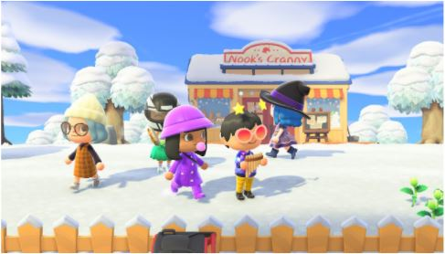
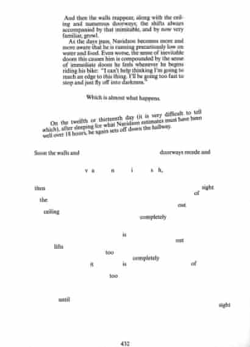
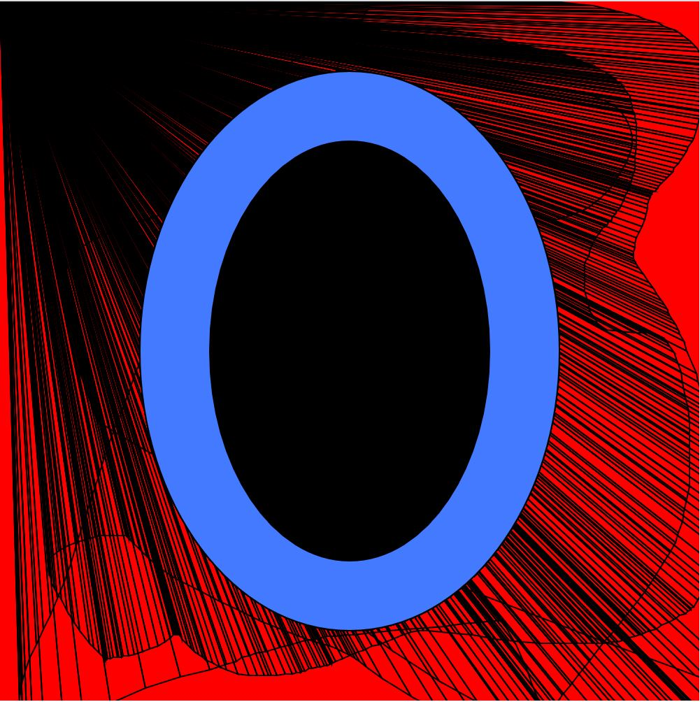
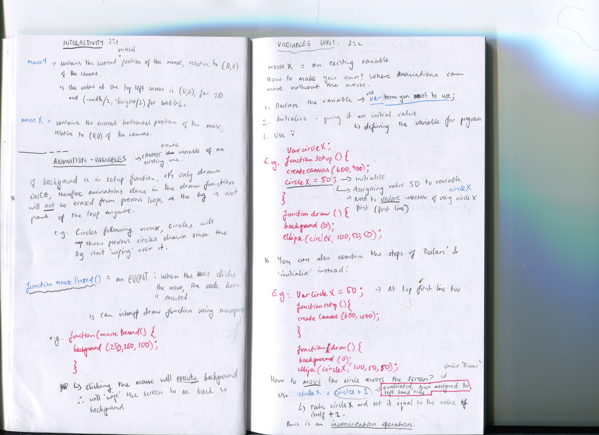

# Horrors of Animal Crossing 

We discussed in small groups different typefaces that have been created around the world: from the traditional typefaces such as Bauahaus to contemporary designers that used code to create typefaces. I personally found this installation by Olivier Vadrot, Rouen 2019 fascinating - the typographical character produced with the collabotration of Bureau Brut and Fanette Mellier, the letters describe a poem by James Noel through the form of circular-shaped nails and can be read in various inclinations. I loved how the roundness of the typeface complimented the circular nails they were placed on, offering a clean appearance of scattered, typewriter keys placed all over the courtyard of a college in Normandy. You can view her full project [here](http://fanettemellier.com/project/les-clous/)

We discussed our first assignment, reading House of Leaves through a game and split into our groups (ours choosing animal crossing). I believe that an elevated sinister mood is higlighted due to the juxtapositon of the family-friendly intended nature of the game, and the horror text. Our chosen chapter to re-enact (chapter 3) provided us with eerie scenes that my group is excited to play out and create with the vast array of scene settings we can create due tto the versatility of items there are in Animal Crossing. 

Whilst reading House of Leaves, I found the authors use of 'cinematic grammar' and attention to detail with design of the publication further pulled me into the story - different fonts being used to different characters, and being purposefully disorientating for the reader - where it seems as if we too, are involved in the storyline with the characters. 

Karens processing tutorial this class brought us deeper into the worlds of p5js, as we continued to work on using the Mousex/mousey function through a more advanced, or different manner. [Here's what we did](https://renpapers.github.io/codeword/Processing%20Sketches/karens__O____week_2) 

This week I also began setting a goal to watch some coding tutorials: this is an entirely new realm to me, and I figured doing some self-exploration would be of help. I started watching the coding train tutorials on youtube, here's some notes I've written (you can find all of them in my 'coding notes' file). 

 

