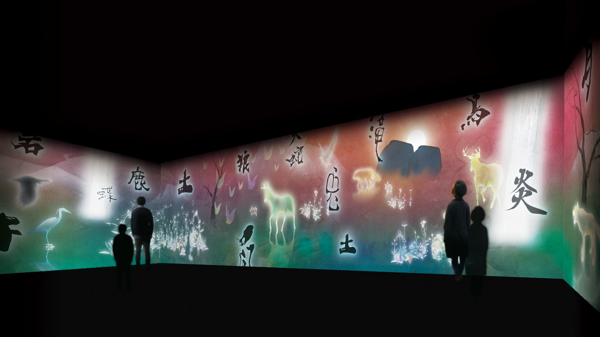

# WEEK 3

At the beginning of this class, Andy introduced us to some examples of electronic literature, such as AI Dungeon: a generative text software where the entire class created a comedic horror story of some sort collectively. The future of design practices and technology was definitely eye opening during this class, as I discovered these case studies and examples to be so otherworldly to the usual narrative we see on paper. It was interesting to see how immersive and real a virtual environment can be, when I used to think the only way this effect could be created was with the physicality of a book. 

Although I didn't personally choose this piece for our individual research, being a fan of TeamLab's works I thought they did an amazing job with tying in words with art and design digitally. ['Story of the time when the Gods First Descended'](https://www.teamlab.art/w/gods1stdescended/) is an interactive artwork, where when the characters are touched, they graphic explanation of the chinese character will appear. In Chinese culture, words are seen to possess spiritual power or language, and characters were born so that power the people invested in words could be "sustained and made more effecitve by putting the words down as pictographs". There's a certain illustrative art to characters that create a narrative, even if you cannot fully understand or read it - something I love about the Chinese language. Teamlab's digital works that involve code and typography is a major factor as to why I decided to explore coding this semester, so I hope to pull more inspiration from them till the end. 

Our group work for AT1 was continued, as our group scripted and read our chapter and assigned roles and tried to connect online in game (had a few connection issues, but all in all was a success!) This was followed by seeking inspiration, and finding very cinematic-type trailers already made on Animal Crossing by other people, [this one](https://www.youtube.com/watch?v=bVx3Xp9OVE8&ab_channel=EvilImp) being a favourite of mine personally. 

