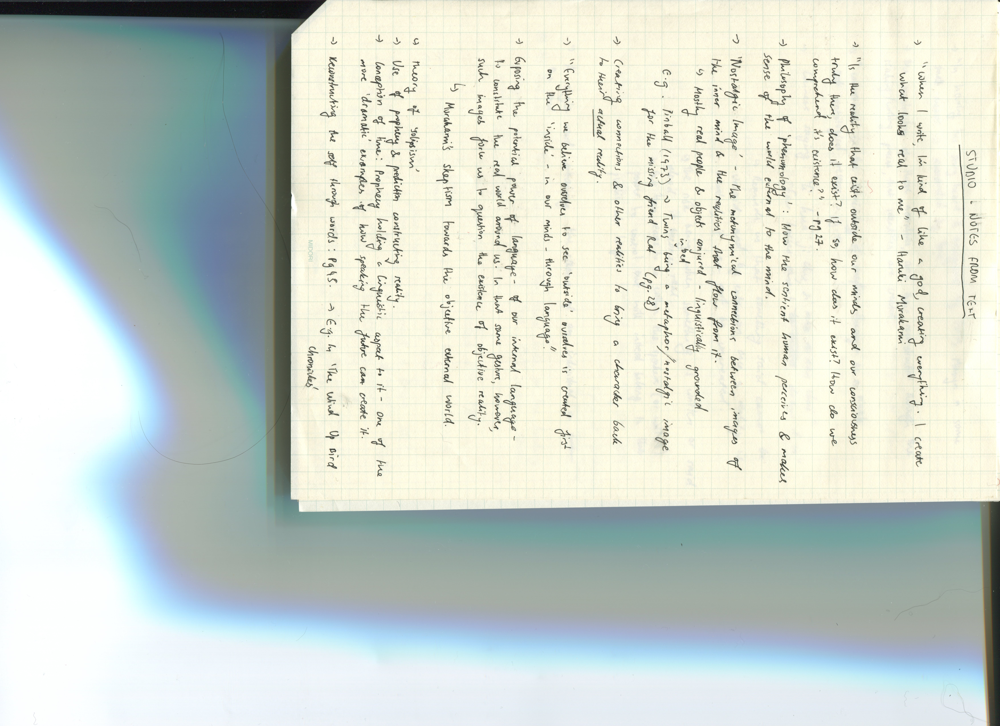
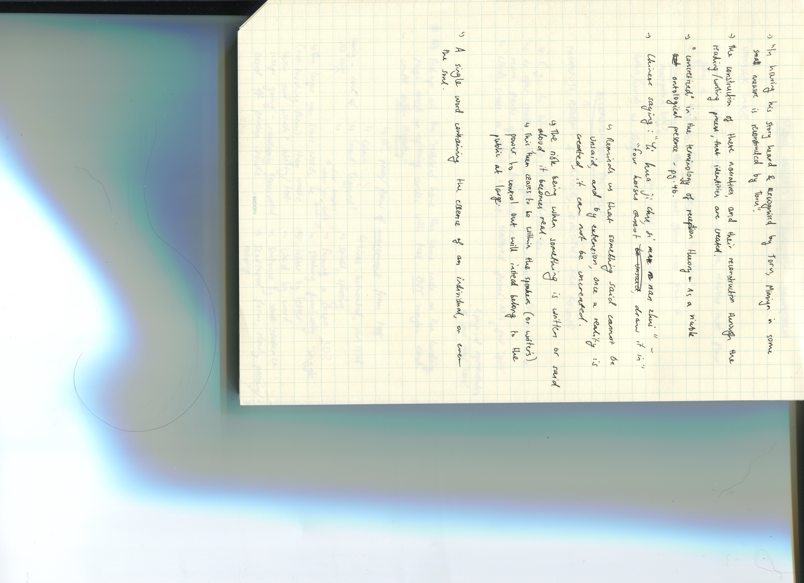

# WEEK 6

Another morning class, another morning class I missed (Andy future me at 16.10.2020 apologises, I think I may have had work this morning.. it was clashing a lot with this studio class, not really a good enough excuse I know :( ). I managed to join in when people were sharing their paper prototypes, and I suppose the method was done so we could have a visual idea of how code or our ideas could poossibly turn out. There's something really lovely and organic about this process, especially since it's' a hand-made, crafty DIY method for a digital output - some things I suppose are better done by hand :). Although I didn't manage to have a piece to share, I managed to view other students' work and loved [Jamie's group piece](https://github.com/Jamtt/Codewords/tree/master/Week%206) inspired by the game Asteroids (designed by Ed Logg and Lyle Rains). The playfulness of this was quite engaging despite the simplicity of it. 
 
The second half of this class was aimed towards us solidifying on choosing a critical theory text. Since last week, I unfortunately had a bit of trouble choosing a text from the pool provided for us - that was filled with an immense, almost overwhelming amount of information, theories and analysis'. I've come to realise I myself enjoy analysing texts and theories, rather than someone else doing them for me which is perhaps why I've been having trouble choosing a text for our next assignment (all texts being based on critical theories). Fortunately Andy allowed me to further self explore a piece of my own, and I decided to find myself an analysis on Haruki Murakami's writings - one of my favourite authors. His works, although having a 'simplistic' writing structure brings our a depth in his stories and characters that immerse readers into his worlds - and I've always wanted to further discover his methods to doing so. Below are some notes I took whilst reading the second chapter of this text (the main chapter I'll be working with for my project). 
 
 

This class we were also introduced to the concept of pseudo code... I'm still getting the hang of it - as it kind of reminded me of poetry but in a code-y context, where a sort of narrative is untold using short sentences (and a lot of 'if's' and 'when's.. or 'while's? aahh Karen help...). Still unsure if this is correct, but as Karen and Andy encouraged us to make our own to get used to the concept, here's a short one I wrote:

START

IF finished uni work
play games
ELSE continue working

IF loss in game
get tilted and rage quit
ELSE
continue playing till 2am 

END

Karen went through a couple new coding tutorials with us again, this time more so playing around with text and how we can animate them in paragraphs, using frame functions and the 'sin' syntax. You can view them [here](https://renpapers.github.io/codeword/Processing%20Sketches/week7_sketch) and [here](https://renpapers.github.io/codeword/Processing%20Sketches/week7_sketch_2)
