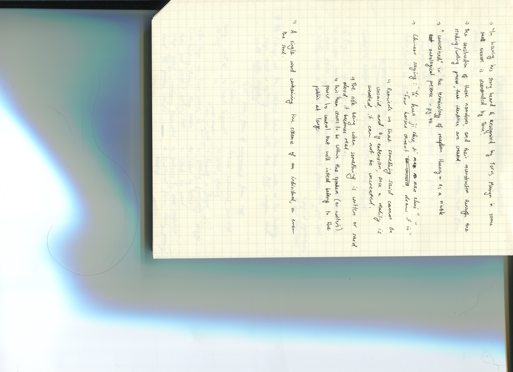

# WEEK 7 

I don't exactly remember, but I believe I was late to this class - late night studying the night before and an early morning the following day + a cozy warm bed + my lack of self restraint caused me to miss the first hour or two :( I swear I'll improve on this... anyway! 

This class we shared our paper prototype ideas/concepts for our final project within groups. I discussed with [Sam](https://github.com/samanthangsy/codewords) and [Natasha's](https://github.com/natnathania/) It was interesting, having to explain our concepts over call without a fully developed sketch. How others perceive your idea may be a lot different to what it actually was intended to be. Althoguh my overall concept has consistently remained the same, it continued to grow as I furthermore branched out with ideas and brainstormed to further finesse the idea. 

My first sketch was based on the song Lion theme from the Film Lion. It just happened to be a song I was listening to at the time and inspired me to create something out of it in the moment. Some good things about the audio file was it had a build up and fair contrast with loud and soft parts creating an interesting visual. For the sketch I decided to use circles with very thin strokes which would spin on a sin wave to create interesting rotations. I guess they represented the main character searching for his lost family through use of google maps. I also added a quick map to show progress of the song on the right hand side. I firstly thought about it as a math equation being the duration of the song needing to match the height of the window but I realised that I could just use the map() function! As the circles build up the paragraph of the plot shows up as if it’s being discovered.

During the second session of class, Karen gave us another walkthrough of a coding tutorial - specifically based on p5js sound libraries. We learnt how to access sound and audio onto our sketches, and other ways we could utilise it such as having it under mousePressed, relating it to visuals on the screen (incorporationg the function amplitude() with text). I played around with a song I was listening to earlier that day by the 1975, and attempted to re-create what Karen had shown us from scratch without rewatching the recording from the lesson (took a couple tries, but eventually I managed to figure it out!)

