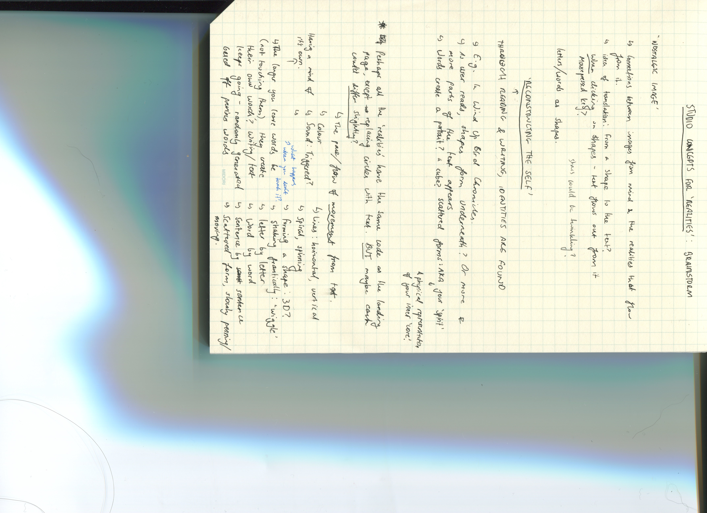

# WEEK 7 

This class we shared our paper prototype ideas/concepts for our final project within groups. I discussed with [Sam](https://github.com/samanthangsy/codewords) and [Natasha's](https://github.com/natnathania/) It was interesting, having to explain our concepts over call without a fully developed sketch. How others perceive your idea may be a lot different to what it actually was intended to be. Althoguh my overall concept has consistently remained the same, it continued to grow as I furthermore branched out with ideas and brainstormed to further finesse the concept. Here's some notes on more ideas I had! I was considering the possibility of hyperlinking each circle, leading the user to another page/sketch that had different interactions with the text being displayed - such as being in a 3d form, appearing word by word, sentence by sentence... etc. All of this would too depend on what the actual paragraph is talking about/analysing in Murakami's' writing (as there are multiple theories discussed in the text, notes provided from [week 6](https://github.com/renpapers/codeword/tree/master/Week%2006). There's something surreal and poetic about a night sky that Murakami's writing I believe stays in tune with - a sort of poetic, melancholy atmosphere that often portrays the character's loss of identity, or findings of it. This is how I came up with the idea of using the visual of a night sky. 

Another concept I had was to create a 3D space, where the viewer is immersed in a sky full of stars that hold similar interactions to my initial concept. [Here's an inspiration example I found of the illusion/use of 3d space](https://editor.p5js.org/YuqiaoQin/sketches/SyFaITU_g). Feeling submerged and enraptured in my sketch is a notion of being involved in a different reality, creating a space for the viewer to explore and wander Murakami's writing I believe connects with the many theories in this text of how immersive a different reality that's created can be. 

During the second session of class, Karen gave us another walkthrough of a coding tutorial - specifically based on p5js sound libraries. We learnt how to access sound and audio onto our sketches, and other ways we could utilise it such as having it under mousePressed, relating it to visuals on the screen (incorporationg the function amplitude() with text). I played around with a song I was listening to earlier that day by the 1975, and attempted to re-create what Karen had shown us from scratch without rewatching the recording from the lesson (took a couple tries, but eventually I managed to figure it out!) You can view it [here](https://renpapers.github.io/codeword/Processing%20Sketches/asoundsketch/)

