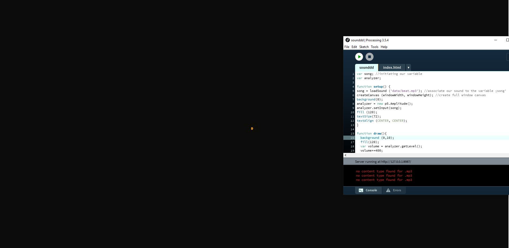

# WIP

- This class we shared our paper prototype ideas/concepts for our final project. 
- shared our texts
- karens coding tutorial: adding audio and music, adding visuals that compliment the music. Here's mine 

