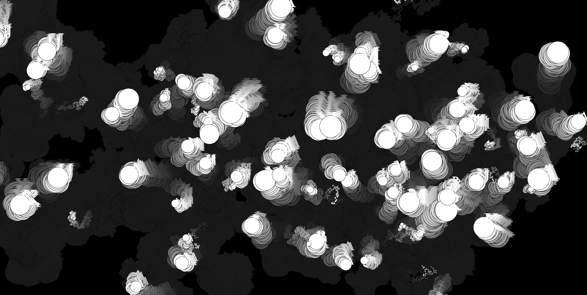

# WEEK 8: MILESTONE FOR AT2: A GALAXY OF REALITIES

Milestoneess! I have made progress yay! This class we shared our paper prototype gifs: mine being the beginning of a narrative (landing page). Focusing now on concepts for the other 'realities' I'll be creating that will include parts of the text. 

We discussed our pseudocode and details for our concept. Since my text writes about how language is used in Murakami's books to define and create realities, the concept for my landing page does this as well; where when the user clicks on the page, a circle (aka a reality) is born. If this is then clicked, it'll direct you to another page that talks about a specific concept the text holds (as there are multiple). 

Unsure if that made sense, but if it didn't hope the gif helps out :) I want to create a 'galaxy of realities'. Perhaps when the mouse hovers and moves, sparks fly from it too, or more, smaller circles (stars) are created, replicating a galaxy of some sort in a digital space. 

These realities will be concepts the text discusses, examples (aka. parts of Murakami's writing that show these concepts), and specific quotes that I found profound and insightful. I'm unsure at this point whether these will all be split into their own individual reality (as that would be a whoollle lot of code that I'm not sure I have the timeline for), or combined into their own concept. 

Karen's workshop this lesson was very in line with the idea I originally had for my sketch - creating 'wiggly letters' that appeared by either the mousePressed function, or using the function keyTyped. This was by far one of the more complex codes I've encountered thus far - in saying this, parts of it applied to my concept for this assignment. We created multiple of the same words (at first using the word 'hello'), Karen mentioned that "all of these 'hello's are remembered. We care for them, we know them, we know where they are, we know the size of them". 

Not sure why I enjoyed that quote so much, I think it just made me realise that there's an intimacy, and an emotional connect you can have with code - something I never really took into consideration, as it's not something I've felt before with code (how closed minded of me). I put my own spin on the code, using the words 'HARUKI MURAKAMI' instead of the ones given to us, and splitting these into their own indivudal letters by creating a new class. These also wiggled - depending on where the mouse was placed, the 'wiggle' would speed up or slow to a halt. Adding an alpha to this, I saw cloud-looking shapes appear in the background due to the reminants created from the wiggle animation - quite an interesting visual. You can view my take on the sketch [here](https://renpapers.github.io/codeword/Processing%20Sketches/wiggly_letters)

- inspiration: Andy gave us a wonderful source of other creatives portfolios, and I've been mesmerised by the graphics and codes I've witnessed. (Seriously giving me some portfolio inspiration too). [Jinhwa Oh's work](https://jinhwaoh.com/) really impressed me, with her coding knowledge and attention to detail with typography that led to beautiful graphics. Specifically, I was in awe of her [moving posters](https://jinhwaoh.com/Falling-poster-s-color-s) piece where she utilised the virtual space to create an animation where the posters fall to the ground in a fluid, beautiful motion as time passes - discussing "What the real graphic design object is-the hanging posters, or the whole image including the poster itself". Her use of gradient colours provided a sentient of time itself as time passed in the animation - a simple yet strong use of visual metaphors that successfully conveyed it's message without being too overcomplicated (something I have trouble doing... which is perhaps why I was so inspired by her piece). 

