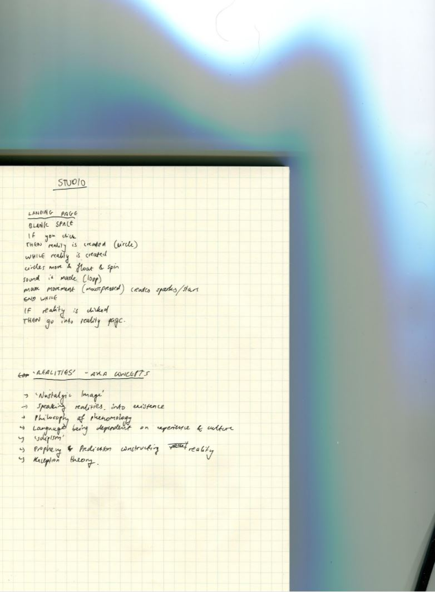
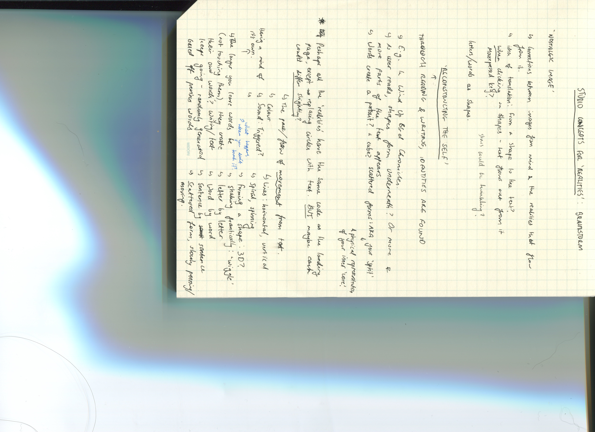
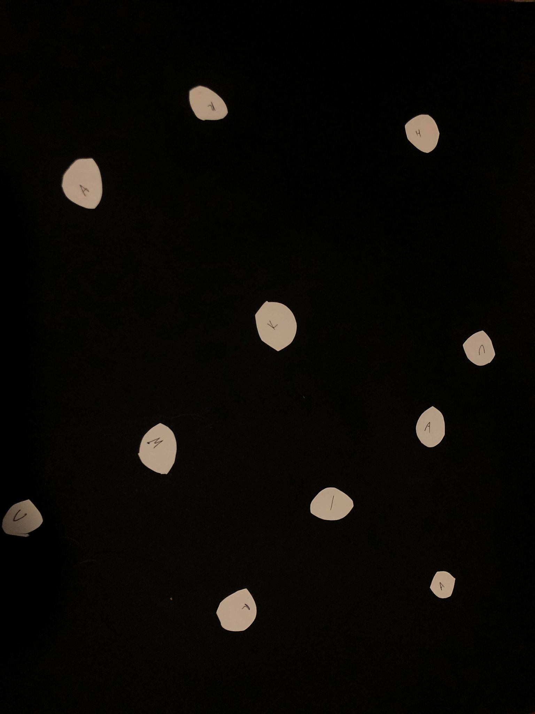

# MILESTONE FOR AT2: A GALAXY OF REALITIES (WIP)

Milestoneess! I have made progress yay! This class we shared our paper prototype gifs: mine being the beginning of a narrative (landing page). Focusing now on concepts for the other 'realities' I'll be creating that will include parts of the text. 

We discussed our pseudocode and details for our concept. Since my text writes about how language is used in Murakami's books to define and create realities, the concept for my landing page does this as well. When the user clicks on the page, a circle (aka a reality) is born. If this is then clicked, it'll direct you to another page that talks about a specific concept the text holds (as there are multiple). 

Unsure if that made sense, but if it didn't hope the gif helps out :) I want to create a 'galaxy of realities'. Perhaps when the mouse hovers and moves, sparks fly from it too, or more, smaller circles (stars) are created, replicating a galaxy of some sort in a digital space. 

These realities will be concepts the text discusses, examples (aka. parts of Murakami's writing that show these concepts), and specific quotes that I found profound and insightful. I'm unsure at this point whether these will all be split into their own individual reality (as that would be a whoollle lot of code that I'm not sure I have the timeline for), or combined into their own concept. So far these are the notes I've gathered on parts of the text I found quite interesting: 

- karens workshop: wiggly letters tutorial. By far one of the more complex codes I've encountered thus far - in saying this, parts of it applied to my concept for this assignment (such as keypressed function, etc...) "all of these 'hello's are remembered. We care for them, we know them, we know where they are, we know the size of them". 
- Discussed datamoshing 
- inspiration: Andy gave us a wonderful source of other creatives portfolios, and I've been mesmerised by the graphics and codes I've witnessed. (Seriously giving me some portfolio inspiration too). Here's an artist I found particularly interesting: 
