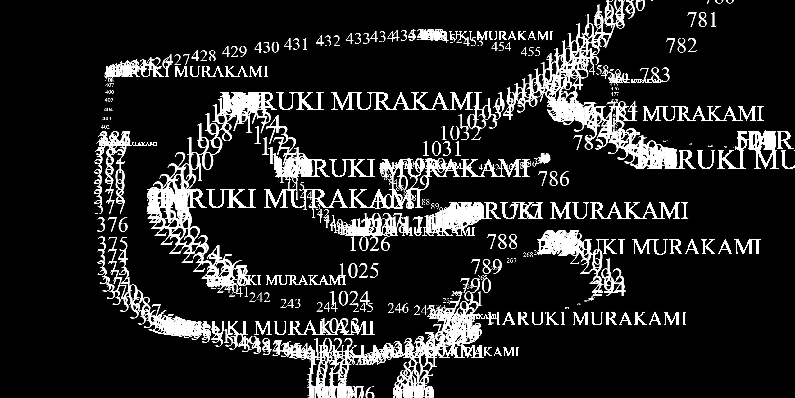
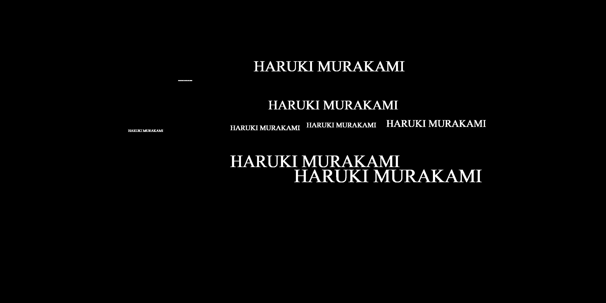
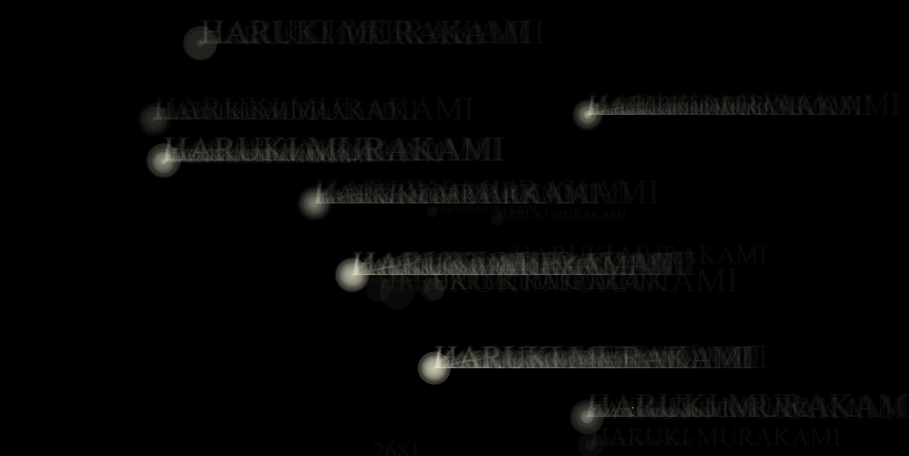

# WEEK 9 : TRIALLING.. MORE TRIALLING....
WARNING: my code has a lottttt of notes and '//' in it! please excuse the mess, it reflects how much of a mess i currently am. My code writing style is a reflection of how my brain works. 

Trial 1

Trial 2

Trial 3

Trial 4: This one I simply added an alpha to the text/ellipses, and I fell in love with how when clicking multiple times, a 'glow' effect was emulated, and added depth to the stars, and a ghostly, sort of lonely feel to the text. I'd like to further explore this and find a way to create a glow effect easily in my sketch. 

## Resources/references I used:

Rewatched Karen's wiggly letters tutorial, and tried following it along as it coincidentally holds a similar concept to my landing page. 

- 'stars' moving in background to add noise and texture, not interactive. I tried to create my own version of this based off of the original code, as well as tried to understand/grasp the concept before using it. 
I wonder why the 'sparkle' variable didn't have to be written before the 'setup' function (ask Karen next class). Other than that, I understood how this mainly used the randomised function. Although I'd also like these to move at a slower pace (1 day later update: after doing some research I realised the 'frameRate' function would fix this).I'd like to get these to fade slowly and then reappear, creating a subtler effect. 
https://editor.p5js.org/elinsterz/sketches/9KRmzsFDM
Another resource I learnt about the randomised function was a week or so ago, from the Coding Train tutorials: https://www.youtube.com/watch?v=nfmV2kuQKwA&ab_channel=TheCodingTrain

tutorial on twinkling stars: https://codeburst.io/sunsets-and-shooting-stars-in-p5-js-92244d238e2b

Learning about shaders to create a 'glow' effect on my stars!: https://p5js.org/reference/#/p5/shader and https://p5js.org/examples/3d-basic-shader.html

### Things I need to change:
- typeface: choose one that fits the mood
- stars in bg: fade effect

### Things I need to add: 
- hyperlink to mousePressed 'realities'/stars: send to another page
- glow effect on stars, 'pulsing' effect
- 
