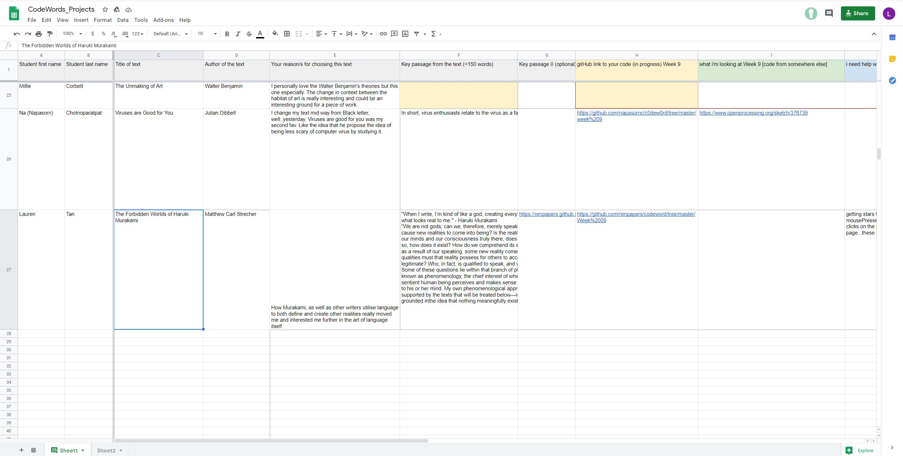

# WEEK 9 : BABY STEPS
WARNING: my code has a lottttt of notes and '//' in it! please excuse the mess, it reflects how much of a mess I currently am. My code writing style is a reflection of how my brain works. 

This class we were working on our own projects - starting to create our own code. Andy provided us with a google docs sheet we could utilise to enter in our progress work for the next few weeks - entering in what we needed help with and what we've managed to do. During this class we were also reminded about how our code cannot be written for us - as Karen mentioned she can lead us towards the right direction, but cannot type in the solution for us. This made complete sense, and I think only further motivated me to do my own research and self-trialling my work (over and over again). 

My concept has remained the same currently, although in mentioning what Karen said, I decided to recreate the [wiggly letters](https://github.com/renpapers/codeword/tree/master/Week%2008) tutorial from last week - except purely from scratch without going through the recorded tutorial. Ultimately, this made me realise I still don't fully understand some of the basics of code (such as how the structure works). I managed to get to a few certain points as you can see below: managing to add an ellipse and utilise the mousePressed function. Although I forgot how to split my sentence ('Haruki Murakami') into individual letters. Stubbornly, I decided not to rewatch Karens tutorial still, and attempt to figure it out myself (this ended up with me staying up till 4am deep in frustration). Facing my code, I realised my concept may be too much of a 'baby' at the moment, and I yearned to add more to it to do the text justice. Simple is good sometimes, yes, but I feel as if my concept needs added  content to it - Either way, I have to start somewhere I suppose - considering I haven't done code before, I'll just take this as a challenge and do one thing at a time I suppose :) 
Anyway here are my trials for this week, and what I discovered/created (may be small, but baby steps, right?) 

[Trial 1](https://renpapers.github.io/codeword/Processing%20Sketches/AT2_trial1/) NOTE: All of the other trials are other variations from trial 1 I played around with. 

Trial 2

Trial 3

Trial 4: This one I simply added an alpha to the text/ellipses, and I fell in love with how when clicking multiple times, a 'glow' effect was emulated, and added depth to the stars, and a ghostly, sort of lonely feel to the text. I'd like to further explore this and find a way to create a glow effect easily in my sketch. 

## Resources/references I used:
'Stars' flickering in background to add noise and texture, not interactive. I tried to create my own version of this based off of the original code, as well as tried to understand/grasp the concept before using it. 

I wonder why the 'sparkle' variable didn't have to be written before the 'setup' function (note to ask Karen next class). Other than that, I understood how this mainly used the randomised function. Although I'd also like these to move at a slower pace (1 day later update: after doing some research I realised the 'frameRate' function would fix this). [Here's the reference I used](https://editor.p5js.org/elinsterz/sketches/9KRmzsFDM)

Another resource where I learnt about the randomised function from a week or so ago, was from [this Coding Train tutorials](https://www.youtube.com/watch?v=nfmV2kuQKwA&ab_channel=TheCodingTrain)

Another tutorial I found on creating [twinkling stars](https://codeburst.io/sunsets-and-shooting-stars-in-p5-js-92244d238e2b). This one was quite easy to follow, although I had to search up certain functions and syntax' they were using to refresh my memory (most of them Karen already mentioned previously I believe). 

Learning about shaders to create a 'glow' effect on my stars!: https://p5js.org/reference/#/p5/shader and https://p5js.org/examples/3d-basic-shader.html

### Things I need to change:
- typeface: choose one that fits the mood
- stars in bg: I'd like to get these to fade slowly and then reappear, creating a subtler effect. 

### Things I need to add: 
- hyperlink to mousePressed 'realities'/stars: send to another page
- glow effect on stars, 'pulsing' effect

I don't want to make this list too long at the moment, as I feel I'll start to overwhelm myself - so again here's to baby steps I can hopefully pull off. Starting was probably the hardest part - code not being a tool I'm familiar with, it was intimidating to start up Processing and type without someone watching over me. This week, although in comparison to some other students I may not have made as much progress, I'm glad I managed to take the first step in starting - the journey continues I suppose :) 

