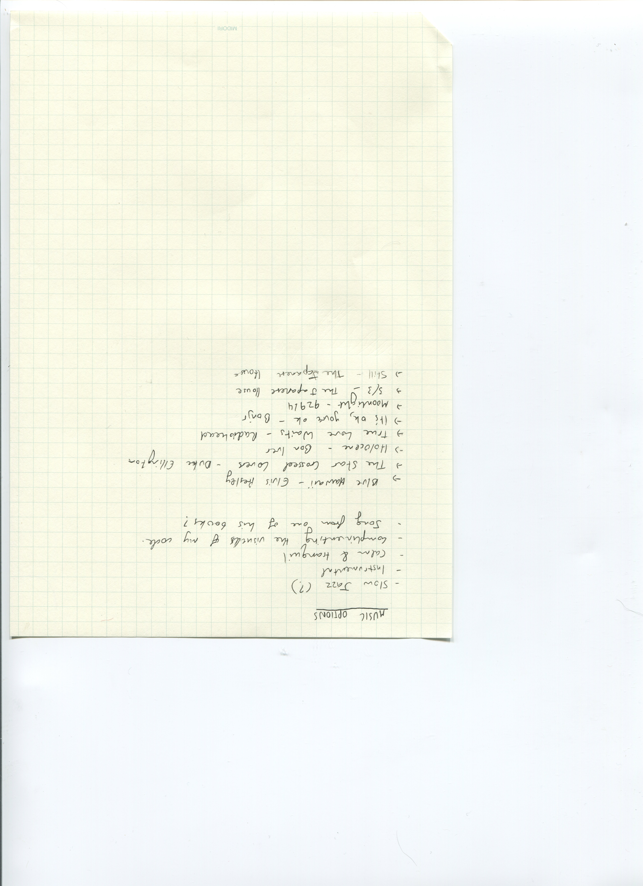

# WEEK 11.5 

Since last week's (week 11) had quite a lot of text, I thought it would be better to split my additional information/discoveries here. Although not added into my code yet, I shortlisted a few songs as options for my sketch. A few of them were songs I recalled from some of Murakami's books. I also found a spotify playlist of the songs he mentions in his works too. I remember reading an interview from the New Yorker, where he mentions how music is part of his process in writing, and I suppose it helps add to the atmosphere and mood of a visual piece too. Therefore I figured I'd use one of his songs he mentions in a book. 

[Here's the spotify playlist](https://open.spotify.com/playlist/6pEMWyjkKbufHyRZ7QZiaS?uri=spotify%3Auser%3Asdmeslow%3Aplaylist%3A6pEMWyjkKbufHyRZ7QZiaS&utm_source=embed_v2&go=1&play=1&nd=1)

After some thought, I decided to use the song [Star Crossed Lovers](https://www.youtube.com/watch?v=fOLwmxoA9gA&ab_channel=simbelmyne) by Duke Ellington - a song mentioned in Murakami's book 'South of the Border, West of the Sun'. The slow paced, classical jazz melody has a tone of 'wonder' and enchantment; an ambience I'm aiming to produce in my sketch. In this short story, the protagonist uncovers "details of stolen moments from the past and present", and the song relates to his relationship with his long lost romantic relationship he once left behind, 'the one that got away' I suppose (well, that's my take on it... who knows in his books honestly). With that context, there's a soft, melancholy tone to the song that leaves a ghostly, sort of bittersweet presence I thought was perfect for my sketch where viewers are able to contemplate and consider the loss of a reality once you find a new one - or the loss of your presence in a reality when a new one is created. I'd also like this piece to be a reminder of how emotionally vehement words and language can be: a concept my text often discusses. 

