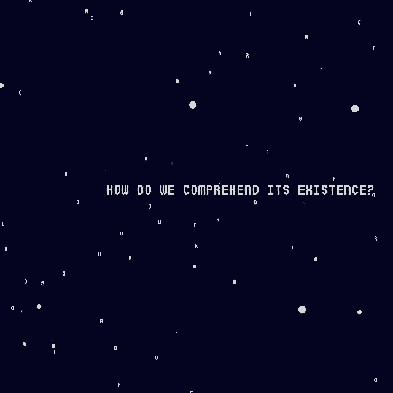
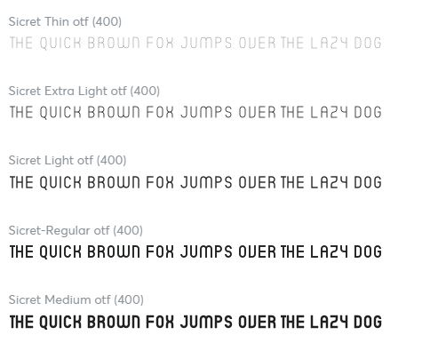
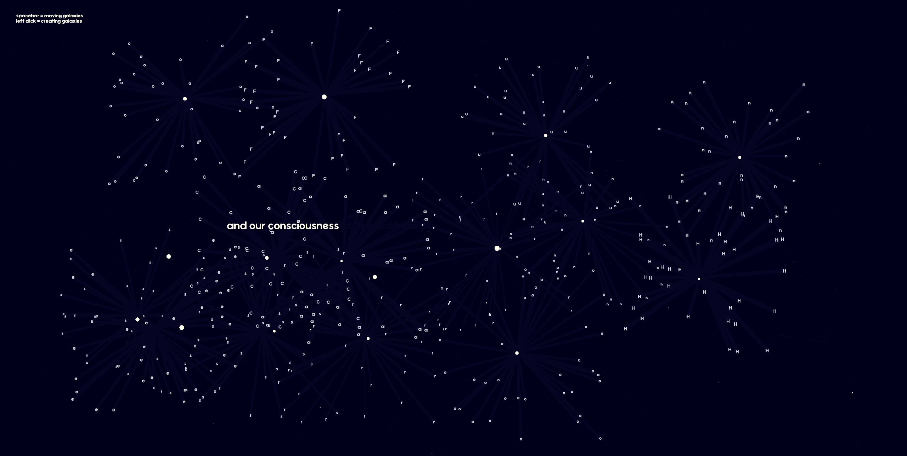
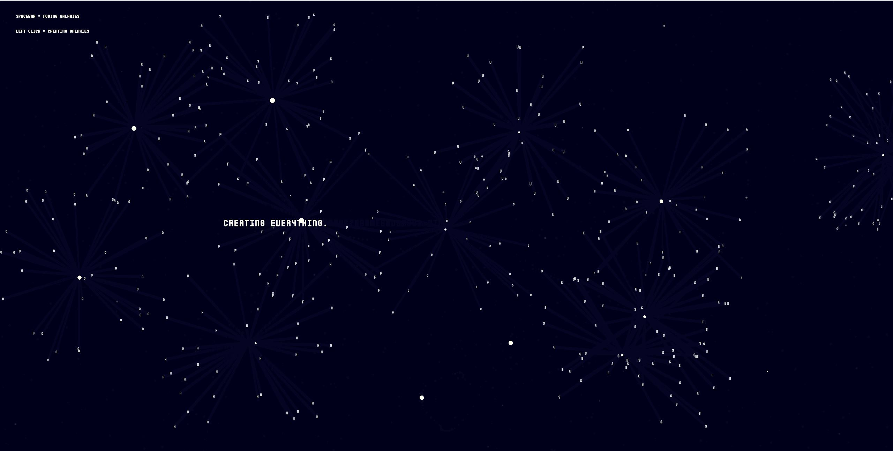
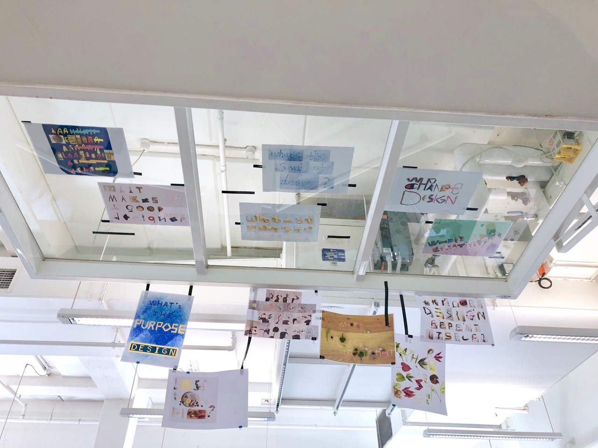

# LAST WEEK (EVER)

This week, as all my final weeks are - was a mess. I 100% work more efficiently when under pressure, and I've always believed fear of 'failure'... no it's not good but it's important (a quote I also found whilst listening to a talk in Adobe Max yesterday by Awkwafina). Both Sam and I enjoyed (and stressed over) our late night chats over teams as we both emotionally supported one another, something I'll miss after this week when uni finishes. 

I further refined my code this week before presentation; changing the stock-standard typeface to one called ['Sicret'](https://creativemarket.com/MansGreback/5033928-Sicret). The monoline font holds a digital nature, and considering this entire assignment was about reading in a digital space, in ways other than on paper I thought it suited well.

The music was also added, where once the user clicks the song begins. I didn't realise that chrome had some issues with playing music, so I had some debugging to do where the song would play over itself whenever the user clicked, creating quite a teriffying melody. Eventually managed to find a sort of 'block' code: userStartAudio(); so it would only play once. I altered a couple more minor details, such as the speed when the letters/stars burst out dragging on a bit more, and changing the max letters to 1084 (a reference to Murakami's book '1Q84') - Although not specifically representing anything, I thought it would be nice to have some hidden references in my code that relates to Murakami's work (the music too), as this caused me to treat code more as a narrative, rather than numbers and letters (at this point I've disassociated code with being dry... I blame my commerce friends for giving me prejudice in the beginning...) 

Choosing a typeface - decided this one was too rounded and 'disney-like'. 

## HERE'S MY STATEMENT FOR MY FINAL: A GALAXY OF REALITIES

[View final code here](https://renpapers.github.io/codeword/Processing%20Sketches/AGalaxyofRealities/)

‘A Galaxy of Realities’ is a visual depiction of Professor
Matthew Carl Strecher’s words from ‘The Forbidden Worlds of
Haruki Murakami’, submerging the screen in a profound space
of clusters and stars. Part of my design philosophy aims
to explore narratives through the surreal eye, producing
immersive pieces that evoke vehement emotion reflects part of
Murakami’s essence in his writing. Like Murakami’s writings,
this project immerses the reader in an illusive, hypnagogic
state except under a digital lense, rather than the pages of
a book.

The text is a reflection and analysis of Murakami’s writing;
discerning how language and words can control, create and
dismiss multiple realities in the perception of a character,
or the universal world as a whole. Murakami’s works is a
labyrinth I’m constantly entranced and lost in, where his
words hold a captivating mist that drifts between reality
and trance. I aimed to produce this sort of atmosphere in my
code.

In the screen as galaxies are created, they spell out a
Chinese translated quote from the text: “Four Horses Cannot
Draw in it” – again reminding us that something said cannot
be unsaid, and the risk of something being written or said,
aloud, becoming real – ceasing to be within the speakers (or
writer’s) power to control. Stars and galaxies are embedded
in code to support this concept; producing an output of
letters that go through the cycle of being wished into
existence by the click of a mouse, then fading into a subtle
presence, layering over one another. The dark background
flickers with smaller specks of stars, adding layers and
depth to the page that furthermore adheres to an immersive
environment, attempting to remove the reader from their own
reality and delve into this newfound one. A click of the
spacebar scatters letters, gliding along the page akin to
shooting stars, then slowing halting to a pause in time – the
reader has now frozen a piece of their own galaxy/reality,
allowing for a contemplative ambience.

----------

## PRESENTATIONS AND REFLECTION

We presented and viewed other students work during class, and created gifs of our own sketch to place in the [wonderful website](https://simandy.github.io/codewords/) Karen and Andy created for us. This entire class I was completely mesmerised and in awe of what people have created. [Fergus' work](https://fergarundel.github.io/CODE-WORDS/week_12/cells_final/) was so clearly in tune with creating a strong atmosphere - from condensed molecules, to spreading out amongst the page and forming words. I found it interesting that as the music begins, the molecules open up too, producing an engaging experience. Also [Jamie](https://jamtt.github.io/Codewords/Week_12/StartofSomething/) literally created his own robot... a consciousness of a good virus. There's an empathetic spirit in his sketch, where the serene mood created by colour, sound and visual senses uncovered a new perspective on a virus' nature - a very accurate representation of the text he chose (Virus's are Good For You). 

These are just examples of the amazing outcomes students in this class created. There's still part of me that feels what I've done is quite rudimentary in comparison to my peer's works - and as Andy mentioned during presentation, my piece (I too believe) has added potential. I'd love to continue working on this code, adding components and playing around with it for an even more concrete outcome. Either way as a reflection, I'm quite proud of where I've come this semester - in terms of both my skillset in code (which was ultimately 0 before this studio) and my mentality on code. It truly has opened another realm of design I'd love to further discover amidst my main practice (traditional illusutration). Throughout this year I aimed to experiment with other aspects of design digitally, and I'm glad to say this studio has only further peaked my curiousity and motivated attitude to learn more abot Processing, and perhaps other platforms code can be written on. 

## A MORE SENTIMENTAL REFLECTION 

Well... I won't say I was on the verge of crying towards the end of this class. I cannot be more grateful for Karen and Andy's help throughout this entire course, and being taught by them was eye opening to me ever since first year - I still remember having trouble with the 'Interviewing a Designer' assignment in first year, and having my entire publication set up in Illustrator (Thank you Andy for introducing me to Indesign... I really had no idea what I was doing). I remember hanging images of our handmade typefaces onto the ascending walls in building 9, and lying down on the floor to view them (found these images on my old tumblr). 

I could not be more grateful for what both of you have taught me ethically and informatively about design, and I suppose a few lessons in life too throughout first year to now. The class ended on a bittersweet note where we all said goodbye, but I hope this isn't the last time I'll get to talk to both of you! Thank you for always believing in your students and pushing boundaries, amongst other aspects you've helped us (me) in. 

That's all for now, bye guys :) 

Lauren 

